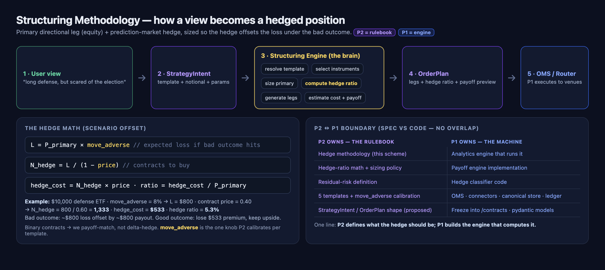
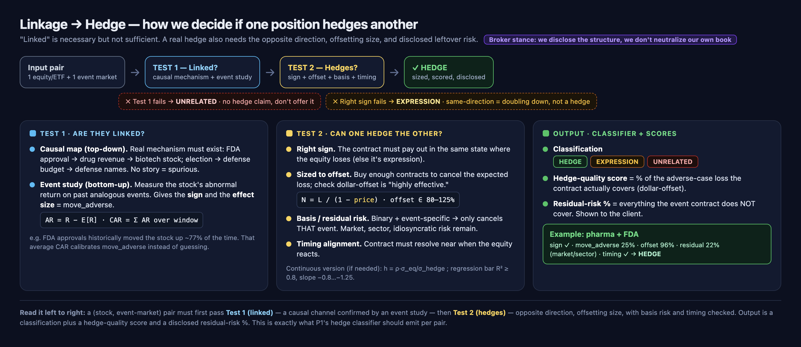

# Structuring Methodology (P2)

> This is the plain-English explanation of the whole P2 approach: what we do, how the hedge math works, and exactly where P2 (methodology) ends and P1 (implementation) begins. Details live in `SPEC.md`, `templates.md`, and `strategy-schema.proposal.md`. The visual is `methodology-scheme.png`.



## 1. The core idea (one sentence)
Turn a plain-language **view about the world** into a **hedged, multi-instrument position** automatically, in one click.

This is the product wedge. Competitors (IBKR, Robinhood, the YC aggregators) let you *find* and *route* to markets. We *construct* the position for you: the directional bet AND the matching hedge, sized correctly. Nobody does turnkey cross-asset event hedges for retail.

## 2. The mental model
Every structured position has two parts:

- **Primary leg** - the equity/ETF that expresses the user's view (e.g. long defense).
- **Hedge leg** - a prediction-market event contract that **pays out if the view's key risk happens** (e.g. "ceasefire / incumbent loses").

We size the hedge so that if the bad outcome hits, the hedge payout roughly cancels the primary's loss. The user keeps the upside of their view but caps the event risk. That structure is, in spirit, a **collar** built across two asset classes.

## 3. How it works - the 6-step pipeline
1. **Resolve template** - look up the chosen combo (see `templates.md`) from the user's intent.
2. **Select instruments** - map the primary (equity/ETF) and the hedge (event contract) to live market IDs via P1's canonical store / matching.
3. **Size the primary** - from the user's notional.
4. **Compute the hedge ratio** - the core quant step (section 4).
5. **Generate legs** - produce the executable order legs (side, qty, slippage cap).
6. **Estimate cost + payoff** - show the user the cost of protection and the payoff under each outcome. P1's risk engine does the real pre-trade check.

Output is a single `OrderPlan`. The engine never touches venues or money - it only computes the plan.

## 4. The hedge math (scenario offset) - this is the heart of it
Event contracts are **binary** (pay $1 or $0), so we hedge by **payoff matching**, not options-greeks. For one combo:

- `P_primary` = USD in the primary leg.
- `move_adverse` = estimated % the primary drops if the bad outcome happens (the **one judgment input per template**).
- `L = P_primary x move_adverse` = expected loss on the primary under the bad outcome.
- `price` = price of the event contract that pays on the bad outcome (0..1 = implied probability).
- Each such contract costs `price`, pays `1`, so net gain if it hits = `(1 - price)`.

**Number of hedge contracts:**
```
N_hedge = L / (1 - price)
```
**Cost of protection:**
```
hedge_cost = N_hedge x price
```
**Hedge ratio (shown in UI)** = `hedge_cost / P_primary` = the % of capital spent on protection.

### Worked example
$10,000 in a defense ETF, template says defense drops ~8% on the bad outcome (`move_adverse = 0.08` -> `L = $800`), and the contract trades at `price = 0.40`:
- `N_hedge = 800 / (1 - 0.40) = 1,333 contracts`
- `hedge_cost = 1,333 x 0.40 = $533` -> hedge ratio = **5.3%**
- If the bad outcome hits: ~$800 equity loss is offset by ~$800 hedge payout (minus the $533 premium). If it doesn't: you lose the $533 premium but keep the equity upside.

## 5. Linkage & hedge effectiveness - how we know two things are linked, and that one hedges the other



"Linked" is necessary but **not sufficient** for "hedges." We run two separate tests per (equity, event-market) pair.

**Broker stance:** we are an agent / riskless principal - we construct and **disclose** the hedge to the client, we do not run hedge accounting or neutralize our own book. So our bar is honest disclosure (the ratio, what it covers, what it doesn't), not minimum-variance optimization.

### Test 1 - Are they linked?
1. **Causal map (top-down):** a real mechanism must exist (FDA approval -> drug revenue -> biotech stock; election -> defense budget -> defense names). No mechanism = treat as spurious.
2. **Event study (bottom-up):** measure the equity's abnormal return on past analogous events to get the **sign** and the **effect size**.
   - `AR = R - E[R]` (expected return from a market model / CAPM), `CAR = sum of AR` over the event window.
   - That historical CAR is how `move_adverse` gets calibrated instead of guessed (e.g. FDA approvals historically moved the stock up ~77% of the time).

### Test 2 - Can one hedge the other?
Linkage plus three more conditions:
1. **Right sign:** the contract must pay out in the same state where the equity loses. Same direction = expression (doubling down), not a hedge.
2. **Sized to offset:** `N = L / (1 - price)`; check the dollar-offset is "highly effective" (covered loss within ~80-125%). Continuous fallback: `h = rho * (sigma_eq / sigma_hedge)`, regression bar R^2 >= 0.8 and slope between -0.8 and -1.25.
3. **Basis / residual risk:** a binary, event-specific contract only cancels the slice of risk from *that* event. Market, sector, and idiosyncratic risk remain - this is basis risk and must be disclosed.
4. **Timing alignment:** the contract must resolve near when the equity reacts.

### Classifier output (what P1's hedge classifier emits per pair)
- **Classification:** `hedge` | `expression` | `unrelated`.
- **Hedge-quality score:** % of the adverse-case loss the contract actually covers (dollar-offset).
- **Residual-risk %:** everything the contract does NOT cover (basis risk) - shown to the client.

Example (pharma + FDA): sign ok, move_adverse 25%, offset 96%, residual 22% (market/sector), timing ok -> **hedge**.

> Full implementation for P1 (formulas, thresholds, pseudocode, output object): see `hedge-classifier.md`.

## 6. Combo templates - and the one knob P2 calibrates
We ship 5 hand-curated "views" (`templates.md`): defense+election, pharma+drug-trial, shipping+Hormuz, rate-sensitive+Fed, crypto-proxy+legislation. Each template hard-codes everything except **`move_adverse`**, which is the single assumption P2 owns and refines with history. Start with sensible estimates; calibrate later.

## 7. Inputs and outputs (the contract)
- In: `StrategyIntent` (template + notional + params).
- Out: `OrderPlan` (legs + hedge ratio + cost + payoff preview).
See `strategy-schema.proposal.md`. It's language-neutral; P1 maps it to pydantic for the FastAPI engine.

## 8. The P1 / P2 boundary (spec vs code) - the no-overlap rule
P1's backend has an "analytics engine (the brain)" = relationship engine + hedge classifier + payoff engine. That is the **same brain** as this methodology. To avoid double-building, we split it cleanly:

| P2 owns (the rulebook) | P1 owns (the machine) |
|---|---|
| The hedge methodology (this doc) | The analytics engine that runs it |
| The hedge-ratio math (section 4) | The payoff engine implementation |
| Residual-risk definition (what counts as "hedged") | The hedge classifier code |
| The 5 templates + `move_adverse` calibration | OMS, connectors, canonical store, ledger |
| The `StrategyIntent`/`OrderPlan` shape (proposed) | Freezing it into `/contracts`, pydantic models |

One line: **P2 defines what the hedge should be; P1 builds the engine that computes it.**

## 9. Assumptions and limitations (say these out loud in the UI)
- Binary outcomes only in v1; multi-outcome markets reduce to the relevant adverse leg.
- `move_adverse` is an estimate, not a promise - show it.
- Timing mismatch: the event may resolve before/after the equity reacts; templates flag poor alignment.
- Liquidity: if the event market can't absorb `N_hedge` near `price`, scale down and tell the user, never silently slip.
- v1 ignores correlation between legs; v2 adds it (P1's payoff engine already plans for correlation).

## 10. Where P2 (you) makes the calls
These are your levers as P2, not P1's:
1. Which templates ship and what each one's primary/hedge instruments are.
2. The `move_adverse` value per template (the calibration).
3. The hedge-sizing policy (full offset vs partial, premium budget cap).
4. The definition of "residual risk" the classifier reports.
5. The payoff/UX framing the user sees.

## 11. Decisions (resolved with P1)
1. **Hedge sizing:** full offset by default, with an **optional premium cap** (`premiumCapPct`) so users don't overpay on expensive hedges.
2. **Execution:** **atomic / all-or-nothing** basket - never leave the user silently unhedged if the hedge leg can't fill.
3. **`move_adverse` source:** lives in **`templates.json`** in this repo (P2-editable); revisit a config service only if it grows.
4. **Scope:** **binary (yes/no) event contracts only** for v1; multi-outcome is deferred.
